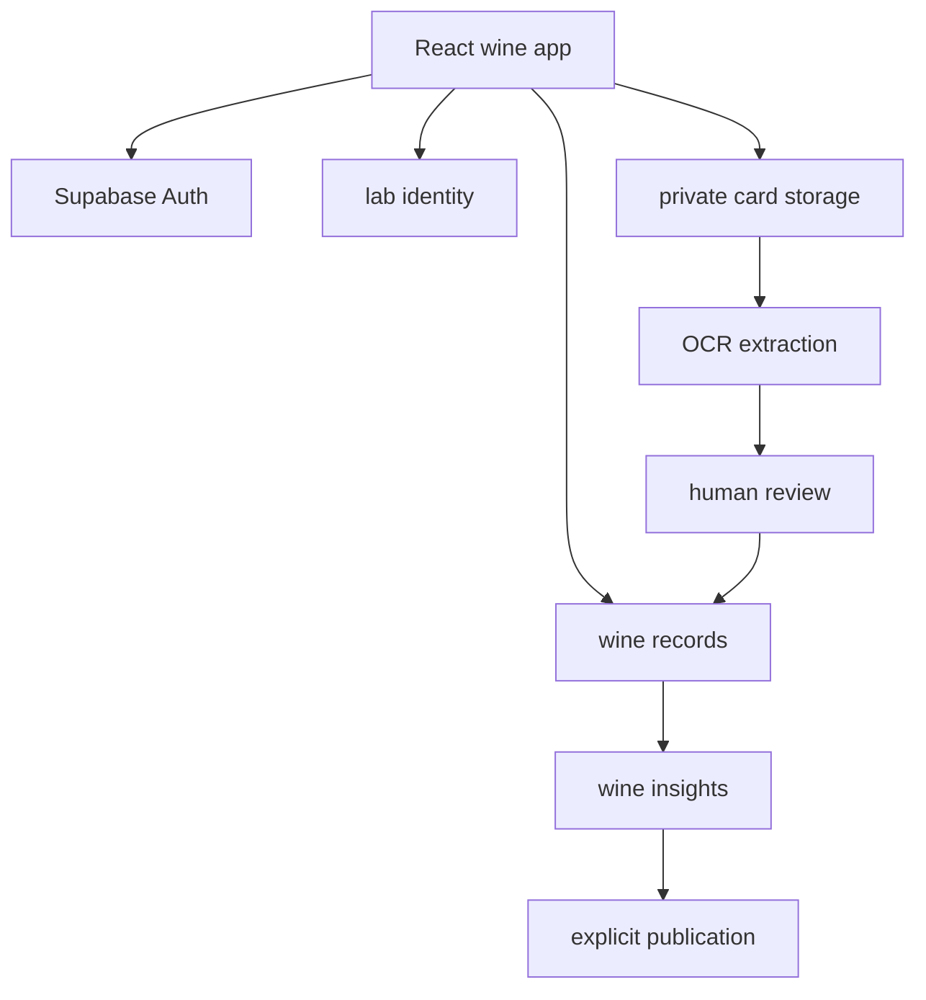
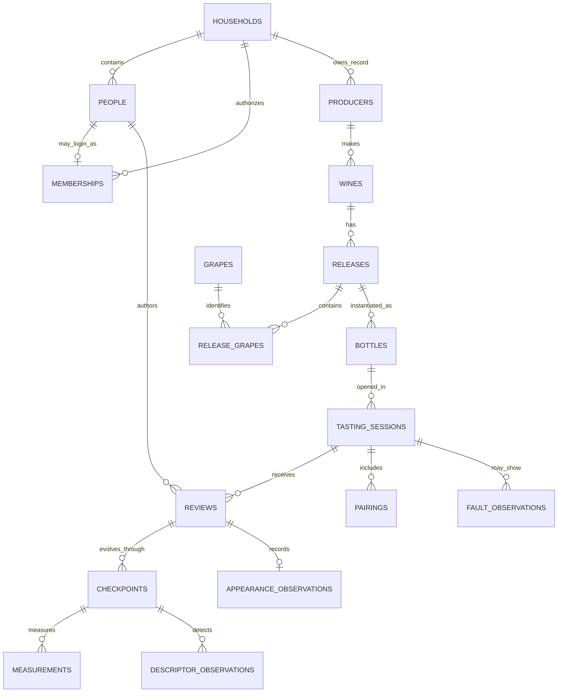
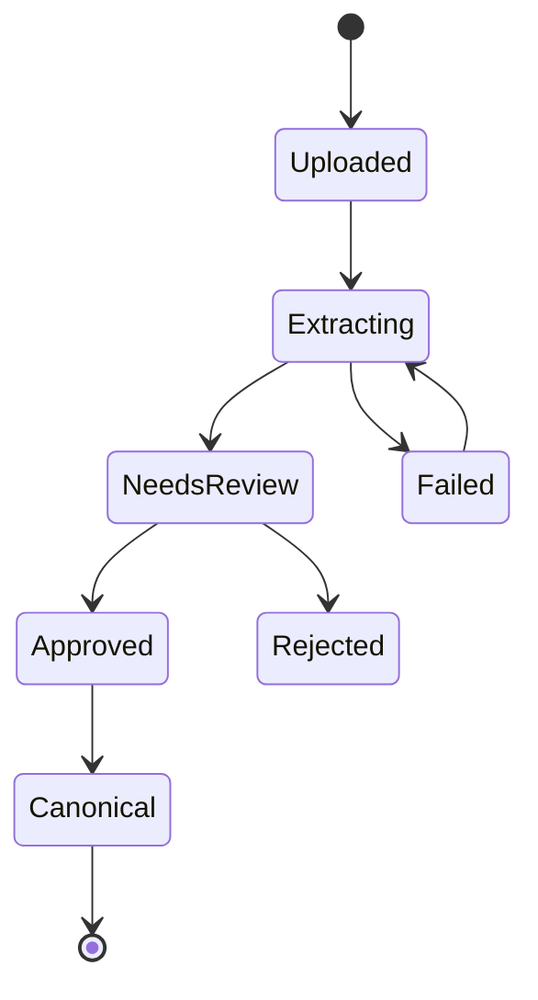

# Grant & Kyle Wine Lab — Architecture Packet

**Status:** Architecture baseline for implementation  
**Scope:** Wine program only  
**Source inspected:** `grantchoy69/picklesAndWine/ourNotes.json`  
**Historical inventory:** 11 individual reviews, grouped into 6 probable tasting occasions

## 1. Mission

Build a longitudinal, context-aware map of Kyle's wine preference landscape without reducing her to a single predicted favorite.

The system should:

- increase the probability that future bottle purchases are rewarding;
- preserve broad exploration and surprising discoveries;
- distinguish detection from pleasure;
- separate wine style from technical quality and bottle faults;
- measure food, temperature, and time-in-glass effects;
- preserve the personality and intimacy of the original cards;
- make data collection enjoyable enough to continue for decades.

The wine program and pickle program are philosophically related but relationally independent. They share only household and person identity.

## 2. Locked decisions

| Decision | Baseline |
|---|---|
| Household | `household_id = 1`, this house |
| Person 1 | `person_id = 1`, Gracie |
| Person 2 | `person_id = 2`, Kyle |
| Historical `"Grant"` taster values | Preserve raw value; map canonically to `person_id = 1` |
| Database | One Supabase project |
| Domain boundary | Wine tables live in the `wine` Postgres schema |
| Shared identity | Household, people, and authenticated membership live in `lab` |
| Internal helpers | Non-exposed `private` schema |
| Frontend | React + TypeScript + Vite, mobile-first |
| Source images | Private Supabase Storage bucket |
| Canonical data | Never written directly by OCR |
| Public content | Explicit publication only; private records are never public by default |
| Historical JSON | Immutable provenance, not discarded after import |

Stable numeric IDs are seed data, not frontend magic numbers. The application looks up the current authenticated person's membership and household rather than trusting IDs supplied by the browser.

## 3. Historical data inventory

### 3.1 Probable tasting occasions

| # | Wine identity in source | Vintage | Reviews | Migration note |
|---:|---|---|---|---|
| 1 | The Collection Pinot Noir | 2021 | Gracie + Kyle | Strong match |
| 2 | The Collection Cabernet Sauvignon | 2022 | Gracie + Kyle | Region and price differ; group but flag for confirmation |
| 3 | The Collection Tempranillo | 2022 | Gracie only | Valid single-taster occasion |
| 4 | 7 Deadly Zins Zinfandel | 2022 | Gracie + Kyle | Strong match |
| 5 | Monte Xanic Chenin Blanc | 2024 | Gracie + Kyle | Strong match; probable technical-fault observations |
| 6 | Stonewood Pinot Noir | Unknown | Gracie + Kyle | Strong match; explicit food interaction |

### 3.2 Schema drift that must be supported

- `huse` is consistently used where the canonical field should be `hue`.
- Ratings include numbers, prose, and blanks.
- Structural axes include categorical text, ranges, prose, and explicit values such as `(3/10)`.
- Region strings vary between tasters for the same probable bottle.
- Price includes currency strings, `Gift`, and blanks.
- Location fields contain both place and personal context.
- Aroma entries mix descriptors, memories, uncertainty, and sentences.
- Viscosity sometimes contains poetic observations rather than a technical measure.
- Finish length and finish pleasure are currently combined.
- Technical-fault assessments appear inside aroma and personal notes.
- Food effects appear in narrative notes rather than first-class measurements.
- One shared bottle is represented by two duplicated wine records instead of one occasion with two reviews.

These are not errors to erase. They document how the tasting practice evolved.

## 4. System boundary



The future pickle module may reuse the app shell and `lab` identities, but it does not reference wine tables.

## 5. Relational model



### 5.1 Why the model has releases, bottles, sessions, reviews, and checkpoints

- A **wine** is the producer/cuvée identity across years.
- A **release** is a vintage-specific expression with region and grape composition.
- A **bottle** carries acquisition, price, storage, and bottle-level variation.
- A **tasting session** is the shared occasion.
- A **review** is one person's interpretation of that occasion.
- A **checkpoint** is that person's response at a particular state: first pour, with food, warmer, or 20 minutes later.

This separation lets the analysis distinguish producer, vintage, bottle, occasion, person, pairing, and evolution effects.

## 6. Table catalog and field dictionary

All canonical operational tables include:

- `id uuid primary key default gen_random_uuid()` unless a stable seeded ID is specified;
- `household_id smallint not null`;
- `created_at timestamptz not null default now()`;
- `updated_at timestamptz not null default now()`;
- `created_by_person_id smallint` when human authorship matters.

### 6.1 `lab` schema

#### `lab.households`

| Field | Type | Rule |
|---|---|---|
| `id` | `smallint` | Seed `1` |
| `name` | `text` | Human-readable; not an authorization input |
| `created_at` | `timestamptz` | Audit |

#### `lab.people`

| Field | Type | Rule |
|---|---|---|
| `id` | `smallint` | Seed `1 = Gracie`, `2 = Kyle` |
| `household_id` | `smallint` | FK to household |
| `display_name` | `text` | Canonical personal display name |
| `active` | `boolean` | Defaults true |

#### `lab.memberships`

| Field | Type | Rule |
|---|---|---|
| `auth_user_id` | `uuid` | PK; FK to `auth.users.id` |
| `household_id` | `smallint` | Authorization boundary |
| `person_id` | `smallint` | Unique canonical person |
| `role` | `text` | Initially `owner` or `editor` |
| `active` | `boolean` | Revocation switch |

RLS checks `lab.memberships.auth_user_id = auth.uid()` and matching `household_id`. User-editable metadata is never used for authorization.

### 6.2 Wine identity and acquisition

#### `wine.producers`

`name`, `normalized_name`, `country_code`, `notes`.

#### `wine.wines`

`producer_id`, `cuvée_name`, `wine_name_raw`, `color_style`, `sparkling_style`, `sweetness_style`, `notes`.

`wine_name_raw` allows uncertain legacy identity to survive while producer and cuvée are later reconciled.

#### `wine.releases`

`wine_id`, `vintage_year smallint`, `vintage_raw text`, `is_non_vintage boolean`, `appellation`, `region`, `country_code`, `abv`, `technical_notes`.

Constraint: a release cannot have both a numeric vintage and `is_non_vintage = true`.

#### `wine.grapes`

Controlled grape vocabulary: `canonical_name`, `aliases text[]`.

#### `wine.release_grapes`

`release_id`, `grape_id`, `percentage numeric(5,2)`, `is_primary boolean`, `source_text`.

Unknown composition is valid. Do not assign 100% merely because the card lists one grape.

#### `wine.bottles`

`release_id`, `bottle_size_ml`, `price_amount numeric(10,2)`, `currency_code`, `acquisition_type`, `acquisition_source`, `purchase_date`, `storage_notes`, `bottle_code`.

`acquisition_type` begins with `purchased`, `gift`, `restaurant`, and `unknown`.

### 6.3 Tasting and review

#### `wine.tasting_sessions`

`bottle_id`, `started_at`, `date_precision`, `location_name`, `location_context`, `occasion_notes`, `service_notes`, `source_confidence`.

`date_precision` supports historical records whose exact date is unknown.

#### `wine.reviews`

One row per person per session.

| Field | Purpose |
|---|---|
| `tasting_session_id` | Shared occasion |
| `person_id` | Gracie or Kyle |
| `overall_enjoyment` | Numeric 0–10 when explicitly supplied |
| `overall_rating_raw` | Exact original value |
| `technical_quality` | Separate from enjoyment |
| `novelty_interest` | Separate from quality and pleasure |
| `typicity` | Optional and nullable |
| `confidence` | Confidence in the review, not model confidence |
| `repurchase_intent` | Structured future behavior |
| `personal_notes` | Exact narrative |
| `review_status` | `draft`, `complete`, or `needs_review` |
| `form_version` | Version of questions used |

Unique constraint: `(tasting_session_id, person_id)`.

#### `wine.review_checkpoints`

| Field | Purpose |
|---|---|
| `review_id` | Parent review |
| `sequence_number` | Stable order |
| `stage` | `initial`, `with_food`, `after_time`, `warmer`, `next_day`, `custom` |
| `elapsed_open_minutes` | Nullable measured time |
| `serving_temperature_c` | Nullable measured temperature |
| `pairing_id` | Optional active pairing |
| `enjoyment_rating` | 0–10 at this state |
| `finish_pleasure` | 0–10 at this state |
| `interest_rating` | “How interesting now?” |
| `notes` | State-specific narrative |

Each migrated review receives one initial checkpoint. Additional historical checkpoints are created only when the source explicitly supports them; values are never invented.

#### `wine.metric_definitions`

Wine-native, versionable sensory axes:

`metric_code`, `display_name`, `low_anchor`, `high_anchor`, `scale_min`, `scale_max`, `unit`, `active_from_form_version`, `active`.

Initial metric codes:

- `sweetness`
- `body`
- `acidity`
- `tannin_firmness`
- `complexity`
- `finish_length`
- `finish_pleasure`
- `aroma_intensity`
- `flavor_intensity`
- `alcohol_warmth`

#### `wine.checkpoint_measurements`

`checkpoint_id`, `metric_code`, `value_numeric`, `value_raw`, `normalization_method`, `normalization_confidence`, `notes`.

Unique constraint: `(checkpoint_id, metric_code)`.

This long-form measurement design allows the tasting sheet to evolve without adding nullable columns for every future axis. A typed analytical view can pivot the stable core metrics.

#### `wine.appearance_observations`

`review_id`, `color_intensity_numeric`, `color_intensity_raw`, `hue_normalized`, `hue_raw`, `clarity_normalized`, `clarity_raw`, `viscosity_numeric`, `viscosity_raw`, `notes`.

#### `wine.descriptors`

Controlled vocabulary with `canonical_name`, `descriptor_family`, `aliases`, and optional chemical/sensory grouping later.

#### `wine.descriptor_observations`

`checkpoint_id`, `descriptor_id nullable`, `source_section`, `raw_text`, `intensity`, `certainty`, `sequence_number`.

`descriptor_id` remains null for memories, metaphors, uncertain phrases, or descriptors not yet reconciled.

#### `wine.prompt_definitions`

Versioned freeform prompts such as the current three vibe/personality questions.

#### `wine.prompt_responses`

`review_id`, `prompt_definition_id`, `response_text`, `sequence_number`.

This preserves the original personality fields while allowing future forms to ask better questions without schema churn.

### 6.4 Context, quality, and experimental interpretation

#### `wine.pairings`

`tasting_session_id`, `pairing_type`, `name`, `description`, `sequence_number`.

Pairing type begins with `food`, `water`, `other_beverage`, and `none`.

#### `wine.fault_definitions`

Controlled vocabulary such as volatile acidity, Brettanomyces markers, oxidation, reduction, refermentation, cork taint, heat damage, and other.

#### `wine.fault_observations`

`tasting_session_id`, `observed_by_person_id`, `fault_code`, `severity`, `confidence`, `note`, `confirmed`.

Faults belong to the bottle/session interpretation, not Kyle's varietal preference.

#### `wine.hypotheses`

`title`, `statement`, `status`, `priority`, `created_by_person_id`, `opened_at`, `closed_at`, `conclusion`.

Status begins with `proposed`, `active`, `supported`, `weakened`, `inconclusive`, and `retired`.

#### `wine.hypothesis_evidence`

`hypothesis_id`, exactly one of `tasting_session_id`, `review_id`, or `checkpoint_id`, `direction`, `weight`, `interpretation`, `added_by_person_id`.

The database stores evidence and interpretation. It does not claim causal certainty.

### 6.5 Provenance and card ingestion

#### `wine.source_records`

Immutable historical import payloads:

`source_type`, `source_name`, `source_index`, `source_hash`, `raw_payload jsonb`, `imported_at`, `resolution_status`.

No update or delete grant is given to normal authenticated clients.

#### `wine.source_links`

Links one source record to canonical session, review, release, or bottle records.

#### `wine.source_documents`

`storage_path`, `sha256`, `mime_type`, `page_count`, `uploaded_by_person_id`, `document_type`, `form_version`, `status`.

Unique file hashes prevent accidental duplicate uploads.

#### `wine.extraction_runs`

`source_document_id`, `provider`, `model`, `model_version`, `prompt_version`, `raw_output jsonb`, `proposed_payload jsonb`, `confidence_summary`, `status`, `error`.

#### `wine.ingestion_drafts`

`source_document_id`, `extraction_run_id`, `draft_payload jsonb`, `validation_errors jsonb`, `reviewed_by_person_id`, `reviewed_at`, `status`.

Canonical records are created only during the `approved` transition.

## 7. Legacy migration contract

### 7.1 Non-negotiable rules

1. Store every original JSON object unchanged in `wine.source_records`.
2. Import is rerunnable by `source_hash` and source index.
3. Never overwrite a human correction on a rerun.
4. Preserve raw text beside every normalized value.
5. Never infer missing ratings, vintages, prices, dates, grape percentages, or temperatures.
6. Every heuristic grouping or normalization records its method and confidence.
7. Ambiguous results enter a review queue.
8. A dry run produces a report before canonical rows are inserted.

### 7.2 Direct mappings

| Legacy path | Canonical destination |
|---|---|
| `taster` | `reviews.person_id` plus raw source |
| `wine_basics.Producer` | candidate producer/wine identity |
| `wine_basics.vintage` | `releases.vintage_year` or `vintage_raw` |
| `wine_basics.grape_s` | release grape candidate |
| `wine_basics.region_country` | parsed release geography plus raw text |
| `wine_basics.price` | bottle acquisition fields plus raw text |
| `wine_basics.where_we_tasted_it` | session location and context |
| `appearance.color` | appearance color intensity |
| `appearance.huse` | appearance hue |
| `appearance.clarity` | appearance clarity |
| `appearance.viscosity` | appearance viscosity raw and optional normalized value |
| `aromas.fruit[]` | descriptor observations, `source_section = fruit` |
| `aromas.non_fruit[]` | descriptor observations, `source_section = non_fruit` |
| `aromas.extra_notes[]` | descriptor or narrative observation after review |
| `palate.*` | checkpoint measurements |
| `vibes_personality.*` | versioned prompt responses |
| `rating` | review overall enjoyment and exact raw rating |
| `personal_notes` | review personal notes |

### 7.3 Normalization policy

| Source form | Treatment |
|---|---|
| Explicit number, such as `7` or `7.5` | Store numeric and raw |
| Explicit scale, such as `High (7/10)` | Store `7`, raw text, method `explicit_parenthetical` |
| Category, such as `Medium` | Store raw; optional numeric only through approved mapping version |
| Range, such as `Low to medium` | Store raw; optional midpoint only as derived analysis, never as source fact |
| Prose rating | Keep numeric null until human review |
| Blank | Null; do not impute during migration |
| `Unknown` vintage | Numeric null, raw `Unknown` |
| `Gift` price | `acquisition_type = gift`, amount null |
| Uncertain descriptor, such as `Cilantro?` | Preserve question mark and lower certainty |

### 7.4 Initial migration review queue

At minimum, flag:

- The Collection Cabernet geography mismatch;
- prose-only Gracie Cabernet rating;
- blank Kyle Chenin rating;
- all inferred shared-session groupings;
- candidate faults from the Monte Xanic notes;
- any aroma `extra_notes` that are memories or quality judgments rather than descriptors;
- all categorical-to-numeric mappings, if enabled.

## 8. Authentication, RLS, and privacy

### 8.1 API surface

- Expose only `lab` and `wine` schemas needed by the frontend.
- Keep helper functions and sensitive internal processing in `private`.
- Grant Data API privileges explicitly in the same migration as RLS and policies.
- Grant nothing to `anon` for canonical private tables.
- Use the frontend publishable key; never expose a secret or service-role key.
- Keep the card-image bucket private.

Supabase's 2026 Data API defaults increasingly require explicit grants, which is helpful here: reachability and row authorization should both be intentional. See [Securing your API](https://supabase.com/docs/guides/api/securing-your-api) and the [April 2026 Data API change](https://supabase.com/changelog/45329-breaking-change-tables-not-exposed-to-data-and-graphql-api-automatically).

### 8.2 Policy shape

Every authenticated table policy checks active household membership:

```sql
exists (
  select 1
  from lab.memberships membership
  where membership.auth_user_id = (select auth.uid())
    and membership.household_id = target_table.household_id
    and membership.active
)
```

Additional rules:

- membership rows are readable only by the mapped user or an owner in the same household;
- update policies include both `using` and `with check`;
- all policy columns are indexed;
- frontend queries still filter by `household_id`;
- views exposed to the API use `security_invoker = true`;
- public publication reads from deliberately published snapshots, not canonical private tables;
- Storage paths begin with the household ID and have matching `storage.objects` policies;
- Storage writes use the API, never direct changes to the `storage` schema.

Private bucket behavior and signed access are described in [Supabase Storage buckets](https://supabase.com/docs/guides/storage/buckets/fundamentals).

## 9. Application routes

| Route | Purpose | Phase |
|---|---|---:|
| `/` | Combined lab homepage shell and public introduction | 4/8 |
| `/login` | Auth | 2 |
| `/lab` | Private overview | 4 |
| `/wine` | Wine overview and current hypotheses | 4 |
| `/wine/history` | Filterable historical dataset | 4 |
| `/wine/tastings/:id` | Shared session with both reviews and checkpoints | 4 |
| `/wine/new` | Fast mobile tasting form | 4 |
| `/wine/new/full` | Full card-compatible form | 4 |
| `/wine/uploads` | Card upload queue | 6 |
| `/wine/uploads/:id/review` | Side-by-side image and proposed fields | 6 |
| `/wine/hypotheses` | Hypotheses and evidence | 5 |
| `/wine/explore` | Coverage and next-experiment suggestions | 7 |
| `/wine/admin/import` | Legacy import report and ambiguity resolution | 3 |
| `/wine/admin/export` | JSON/CSV portable backup | 4 |

## 10. Mobile tasting workflow

### Fast mode

1. Select or photograph bottle.
2. Create or join a tasting session.
3. Choose Gracie or Kyle automatically from login, with an explicit switch only when recording for the other person.
4. Record overall enjoyment, structure, descriptors, finish pleasure, interest, food, and notes.
5. Save as draft at any point.
6. Add a checkpoint with one tap when food arrives or the wine changes.

### Full mode

Includes appearance, versioned prompts, technical-quality assessment, possible faults, repurchase intent, and detailed service context.

Fast and full modes write to the same tables. They differ only in required fields and interface density.

## 11. OCR state machine



Approval is transactional:

1. validate the draft;
2. create or match wine identity;
3. create release and bottle when needed;
4. create or match session;
5. create review and initial checkpoint;
6. create measurements, descriptors, prompts, and source links;
7. mark draft approved;
8. commit everything or nothing.

## 12. Analytical layer

Operational records remain normalized. Analytical views provide model-ready rows.

### Initial views

- `wine.review_fact`: one row per review with stable summary fields;
- `wine.checkpoint_fact`: one row per person, bottle state, and pairing state;
- `wine.descriptor_fact`: one row per descriptor detection;
- `wine.release_dimension`: producer, vintage, grape, and geography;
- `wine.preference_training_view`: Kyle-only outcomes with context and fault exclusions;
- `wine.data_quality_queue`: missing, ambiguous, or conflicting records;
- `wine.exploration_coverage`: sampled and under-sampled structural regions.

Views exposed through the Data API use security-invoker behavior and remain subject to underlying RLS.

### Modeling guardrails

- Kyle's ratings are the primary preference outcome.
- Gracie's reviews are comparative context, not labels for Kyle.
- Faulted or questionable bottles are included but explicitly flagged.
- Detection features and enjoyment outcomes remain separate.
- Repeated checkpoints from one review are correlated observations, not independent samples.
- Multiple bottles of one release are necessary before estimating bottle consistency.
- Recommendations optimize a mixture of expected enjoyment, information value, novelty, and unexplored-space coverage.
- Model confidence must reflect the tiny, dependent, actively selected sample.

## 13. Implementation milestones

| Milestone | Deliverable | Exit condition |
|---:|---|---|
| 1 | Architecture baseline | This packet approved |
| 2 | Supabase foundation | Versioned schemas, seed identities, Auth mapping, grants, RLS, private bucket, tests |
| 3 | Legacy importer | Dry-run report reconciles 11 reviews into 6 proposed sessions; rerun is idempotent |
| 4 | Mobile MVP | Both people can create, draft, resume, and view a tasting from a phone |
| 5 | History and hypotheses | Filterable data, review detail, hypothesis evidence |
| 6 | Card ingestion | Upload, OCR proposal, side-by-side correction, transactional approval |
| 7 | Exploration insights | Coverage, pairing/time effects, next-experiment suggestions |
| 8 | Public lab layer | Explicitly published aggregate cards only |
| 9 | Pickle integration | Shared shell and derived homepage counts; no cross-domain foreign keys |

## 14. Supabase foundation acceptance tests

### Identity and authorization

- Unauthenticated requests cannot read any canonical wine row.
- Gracie and Kyle can access household `1`.
- A test user outside household `1` cannot read or mutate its rows.
- Changing a browser-supplied `household_id` cannot cross the RLS boundary.
- Deactivated membership immediately blocks new database operations.
- No policy depends on `raw_user_meta_data`.

### Data integrity

- One person cannot have two reviews in the same tasting session.
- A checkpoint sequence is unique within a review.
- Numeric ratings and measurements respect their declared scales.
- A non-vintage release cannot also carry a numeric vintage.
- A source record hash cannot import twice.
- An approved OCR draft cannot approve twice.
- Failed transactional approval leaves no partial canonical records.

### Migration

- Dry run reports 11 source reviews.
- Dry run proposes 6 sessions.
- Canonical import preserves all 11 raw payloads.
- Every imported review links back to its source record.
- Rerunning the importer creates zero duplicates.
- Ambiguous fields remain null or queued rather than guessed.

### Storage

- Card images cannot be downloaded anonymously.
- Signed links expire.
- Duplicate file hashes are detected.
- Storage replacement policies include the permissions required for upsert.

## 15. Immediate implementation sequence

1. Create a new branch from the current repository.
2. Scaffold the Vite React TypeScript app without replacing the deployed `main` site.
3. Initialize Supabase local development and create migrations through the CLI.
4. Migration 1: `lab`, `wine`, and `private` schemas plus explicit grants.
5. Migration 2: household/person seeds and membership model.
6. Migration 3: wine identity, tasting, review, provenance, and indexes.
7. Migration 4: RLS policies and RLS tests.
8. Migration 5: private Storage bucket and object policies.
9. Implement the legacy importer in dry-run mode.
10. Review the six proposed session groupings together.
11. Import canonical historical records.
12. Build the mobile review form against the real migrated data.

## 16. Decisions intentionally deferred

These do not block the foundation:

- exact OCR provider and model;
- final visual design;
- whether public hosting remains GitHub Pages long term;
- offline PWA drafts;
- the first statistical model family;
- chemical/aroma ontology depth;
- public publication cadence;
- restaurant bottle-photo lookup integrations.

The next concrete artifact after approval is the Supabase foundation migration set plus a dry-run legacy importer.
